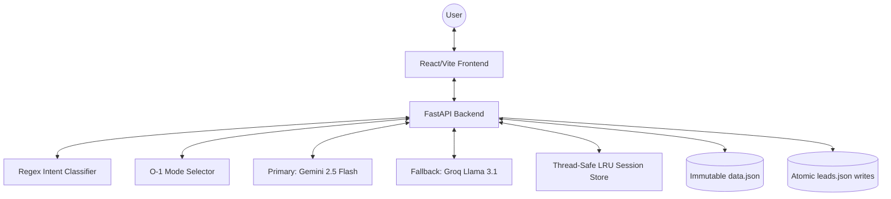

# NexPath NOVA Chatbot

NexPath NOVA is an advanced, production-ready admissions assistant designed to guide students through course selection and enrollment with high resiliency.

## Architecture



## Mode Selector Pseudocode

```python
FUNCTION select_mode(intent):
    IF intent IS career_query:
        RETURN Consultant
    ELSE IF intent IS course_query:
        RETURN Expert
    ELSE IF intent IS casual:
        RETURN Peer
    ELSE IF intent IS lead_capture:
        RETURN LeadFlow
    ELSE IF intent IS complaint:
        RETURN Support
    ELSE:
        RETURN Fallback
```

## Design Decisions

1. **Rule-Based Pre-Classification**: We use an optimal O(1) dictionary routing and word-boundary regex intent classifier before the LLM call to ensure accurate state management (handoffs, lead capture).
2. **High Availability Fallbacks**: The system utilizes Google Gemini 2.5 Flash as the primary LLM, with an automatic fallback to Groq (Llama 3.1) upon 503 or timeout errors to guarantee uptime.
3. **Robust State & Concurrency**: Backend maintains session sequences in a threaded LRU `SessionStore` mitigating memory bounds, and relies on `tempfile` atomic renames for `leads.json` to prevent race condition data corruption.
4. **Strict Safety Pipelines**: Prompt injection defenses isolate user payloads, Pydantic schemas enforce strict payload boundary sanitization (e.g., `< 1MB` constraints), and post-generation regex filters sanitize LLM conversational crutches before reaching the frontend.

## Setup

1. **Backend**:
   ```bash
   cd backend
   pip install -r requirements.txt
   # Set both API_KEY and GROQ_API_KEY in backend/.env
   uvicorn app.main:app --reload
   ```

2. **Frontend**:
   ```bash
   cd frontend
   npm install
   npm run dev
   ```
