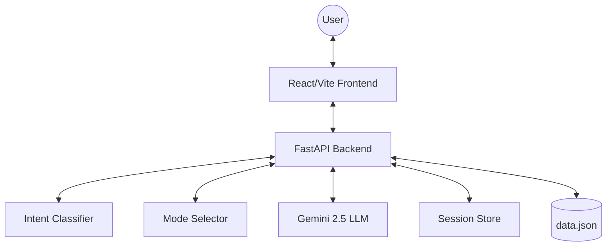

# NexPath NOVA Chatbot

NexPath NOVA is a production-ready admissions assistant designed to guide students through course selection and enrollment.

## Architecture



## Mode Selector Pseudocode

```python
FUNCTION select_mode(intent):
    IF intent IS career_query:
        RETURN Consultant
    ELSE IF intent IS course_query:
        RETURN Expert
    ELSE IF intent IS casual:
        RETURN Peer
    ELSE IF intent IS lead_capture:
        RETURN LeadFlow
    ELSE IF intent IS complaint:
        RETURN Support
    ELSE:
        RETURN Fallback
```

## Design Decisions

1. **Rule-Based Pre-Classification**: We use a keyword-based intent classifier before the LLM call to ensure consistent state management (handoffs, lead capture) and to reduce token usage for simple queries.
2. **Stateless LLM Logic**: The backend maintains session history in a `SessionStore` and injects it into every LLM call, ensuring the API remains stateless and scalable.
3. **Stateless UI**: The frontend is a thin layer that reflects the state (intent, mode, flags) returned by the backend, ensuring a single source of truth.
4. **Post-Generation Filtering**: To strictly enforce "Forbidden Phrases" (e.g., 'cheap'), we implement a secondary filter that sanitizes LLM output before it reaches the user.

## Setup

1. **Backend**:
   ```bash
   cd backend
   pip install -r requirements.txt
   # Set API_KEY in .env
   uvicorn app.main:app --reload
   ```

2. **Frontend**:
   ```bash
   cd frontend
   npm install
   npm run dev
   ```
